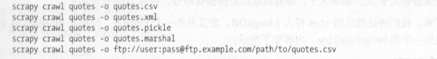

## 流程

### 1命令行

#### 1.1 创建新项目

​	使用命令行创建

```python
#cd到合适的文件夹
scrapy startproject proj_name #bus_lines

```

#### 1.2生成新的爬虫类

```python
scrapy genspider spider_name domains	#example example.com
```


#### 1.3开始运行爬虫

```python
scrapy crawl spider_name	#BusLineSpider
```


### 2 编写爬虫

#### 2.1 必要的类属性

```python
class BusLineSpider(scrapy.Spider):
    name = 'BusLineSpider'	#一定要
    allowed_domains = ['guangzhou.8684.cn']
    start_urls = ['https://guangzhou.8684.cn/']	#种子url
```


#### 2.2 Item

​	Item可以看成一个字典，这里的Item是继承后的Item

```python
# 这里的Item是继承后的Item
class BusLinesItem(scrapy.Item):	#名字跟BusLineSpider很像
    # define the fields for your item here like:
    # name = scrapy.Field()
    name = scrapy.Field()	#给字典命名键
    url = scrapy.Field()	#给字典命名键
```


#### 2.3解析

​	我用xpath语法，也可用css（没学过）

+ 

```python
# extract_first()	返回列表第一个值，相当于	lst[0]
# extract()		返回列表，相当于	lst

    def parse(self, response):
        bus_categ = '/html/body/div[6]/div[1]/div[4]/div/a'     #公交线类别，根节点
        quotes = response.xpath(bus_categ)  #结点
        for quote in quotes:
            item = BusLinesItem()   #相当于字典
            item['name'] = quote.xpath('./text()').extract_first()  #
            item['url'] = quote.xpath('./@href').extract_first()  #extract()  
            yield item
```


#### 2.4 输出

​	输出到json格式

```python
scrapy crawl BusLineSpider -o file_name.json	#json文件
scrapy crawl BusLineSpider -o file_name.json -jl	#一行
scrapy crawl BusLineSpider -o file_name.json -jsonlines	#一行
```



## *、错误处理

+ [scrapy 爬豆瓣返回403错误的解决方法](https://blog.csdn.net/xiemanR/article/details/53930164)

+ [Python3.7 scrapy遇到async报错](https://blog.csdn.net/dvivily/article/details/81326792)


​	返回json数据

```python
jsonresponse = json.loads(response.body_as_unicode())
```


+ params/query参数问题

```
from urllib.parse import urlencode	#用于字典
from urllib.parse import quote	#用于字符串
```


*、细节处理

+ [scrapy 设置请求头agent和代理](https://www.jianshu.com/p/712fc71bfb2e)

+ [随机请求agent](https://blog.csdn.net/weixin_42812527/article/details/81366397)
+ [scrapy 如何修改请求头](https://blog.csdn.net/qq_24861509/article/details/48019629)

+ [scrapy模块的请求头设置多种方法](https://blog.csdn.net/mouday/article/details/80776030)

ps:Scrapy 中headers参数不能出现cookies

+ [字符串，format高级](https://segmentfault.com/a/1190000015622065)

