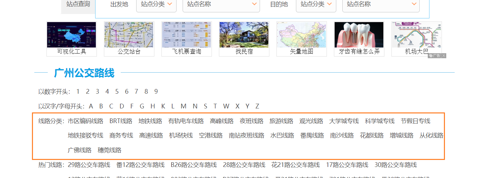
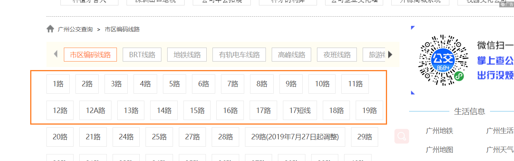
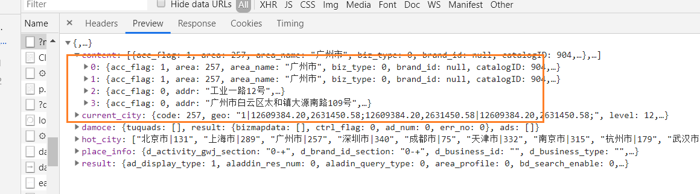
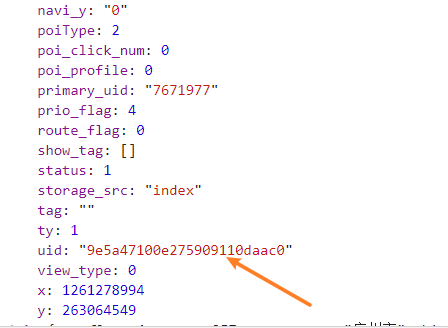
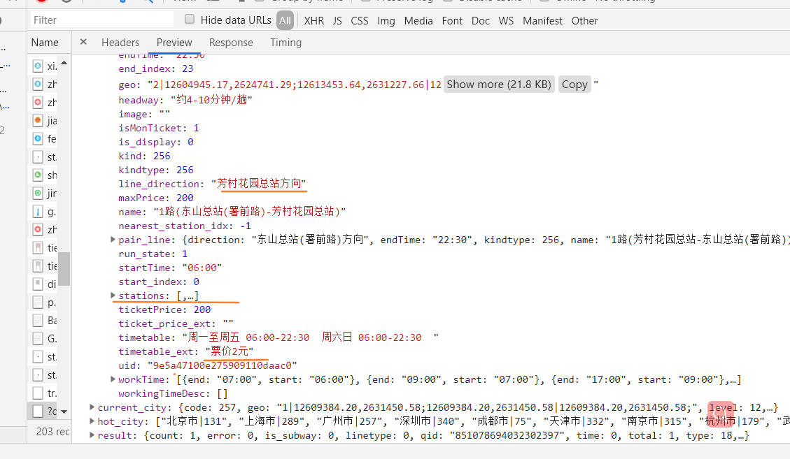

## 一、探索

### 1.1 公交站点名查询

+ [广州公交查询](https://guangzhou.8684.cn/)

#### 1.1.1 分类网址

​	收集线路分类中所有公交名称信息



```python
url = 'https://guangzhou.8684.cn/'	#
bus_categ = '/html/body/div[6]/div[1]/div[4]/div/a'	#分类标签


# 市区编码线路 /line1
# BRT线路 /line2
# 地铁线路 /line3
```


#### 1.1.2 公交站名

​	保存公交站名



```python
url = 'https://guangzhou.8684.cn/line1'
bus_name = '//*[@id="con_site_1"]/a'
	
# 27路 /x_f5ffbb57
# 28路 /x_02c1ddbc
# 29路(2019年7月27日起调整) /x_6f894463
# 29路 /x_edef8eba
```


### 1.2站点名-->位置

+ [百度地图公交](https://map.baidu.com/@12627007,2624047,13z)

​	（Ctrl+F）、（Ctrl+V）大法好

#### 1.2.1 搜索地铁名得到id

​	好奇acc_flag参数有何意义。



​	关键：uid，用来构造url




```python
url = 'https://map.baidu.com/'

headers ={'Accept-Encoding': 'gzip, deflate, br',
 'Accept-Language': 'zh-CN,zh;q=0.9,en;q=0.8',
 'Connection': 'keep-alive',
 'Cookie': 'BIDUPSID=62129821058774371F3A17FC16ABA79B; BAIDUID=83054FAC5EB1D0333FBE70EF9101D4D5:FG=1; PSTM=1553573489; BDSFRCVID=ef4OJeC62ljZAS3wLajzboxyfG7wTAnTH6ao1SRUgTsi9fEQ0nKOEG0PeM8g0KAbq_xqogKK3gOTH4DF_2uxOjjg8UtVJeC6EG0P3J; H_BDCLCKID_SF=tJkJ_DtafC83HJbGh-Q_bKCOMfQXbPcX5-o2WbCQblIV8pcNLTDKQUA-QpbI-M7K2JraW-nX5JCh8-oDXpO1j4_eQtceKp4tJHvb5lrkHlb2_p5jDh31b6ksD-Rt5f6x365y0hvctb3cShPmQMjrDRLbXU6BK5vPbNcZ0l8K3l02VKO_e6L2e533eH_Dqbbfb-oaBDK-tTrjDnCr-PcdXUI8LNDH3CrgK2QXLhRq2f5DDPnwb4FhDUDj-RO7ttoybR52KbjdMnnCoRDxqfDB0xL1Db3-KjvMtg3tsR0E2hjoepvoDPJc3Mv3Q-jdJJQOBKQB0KnGbUQkeq8CQft205tpeGL8q6kfJJuJV-oH5nTKeJOmqRbEhtD_qlOK2-jKa-o2WbCQ5RLM8pcNLTDKh-IlLJ-e-M7K2jQaW-nX5q0bfUbqhlO1j4_eDJbNL4bn-KK80q5ltnrv8p5jDh3qXjksD-RC5JodMT6y0hvctb3cShPmQMjrDRLbXU6BK5vPbNcZ0l8K3l02VKO_e4bK-Tr0jGtJtU5; H_PS_PSSID=; BDRCVFR[buve_JmS-26]=9xWipS8B-FspA7EnHc1QhPEUf; delPer=0; pgv_pvi=360038400; pgv_si=s5116510208; ZD_ENTRY=google; BDORZ=FFFB88E999055A3F8A630C64834BD6D0; PSINO=1; MCITY=-%3A',
 'Host': 'map.baidu.com',
 'Referer': 'https://map.baidu.com/search/1%E8%B7%AF/@12605568.38702564,2627977.4400000004,13.95z?querytype=s&da_src=shareurl&wd=1%E8%B7%AF&c=257&src=0&pn=0&sug=0&l=13&b=(12600151,2627495;12649303,2639239)&from=webmap&biz_forward=%7B%22scaler%22:2,%22styles%22:%22pl%22%7D&device_ratio=2',
 'User-Agent': 'Mozilla/5.0 (Windows NT 10.0; Win64; x64) AppleWebKit/537.36 (KHTML, like Gecko) Chrome/75.0.3770.142 Safari/537.36'}

params ={'newmap': '1',
 'reqflag': 'pcmap',
 'biz': '1',
 'from': 'webmap',
 'da_par': 'direct',
 'pcevaname': 'pc4.1',
 'qt': 's',
 'da_src': 'shareurl',
 'wd': '1路',	#修改你的查询
 'c': '257',	
 'src': '0',
 'pn': '0',
 'sug': '0',
 'l': '13',
 'biz_forward': '{"scaler":2,"styles":"pl"}',
 'device_ratio': '2',
 'auth': 'zI2YUWN3v2SxvQH7GwyXg3H4XKxVw9=BuxHLBTRzHVxtAmk5zC88y1GgvPUDZYOYIZuVt1cv3uVtcvY1SGpuEtJggagyYxPWv3GuVtUvhgMZSguxzBEHLNRTVtcEWe1GD8zv7u@ZPuVteuVtegvcguxHLBTRzHVxtfiKKv7urZZWuV',
 'tn': 'B_NORMAL_MAP',
 'nn': '0',
 'u_loc': '12624007,2621047',
 'ie': 'utf-8',
 't': '1563982500186'}	#我猜最后一个参数应该是时间戳


# 'search_ext': [{'title': '', 'wd': '1路'}]},
# 'content': [{'acc_flag': 1,
#              'area': 257,
#              'area_name': '广州市',
#              'biz_type': 0,
#              'brand_id': None,
#              'catalogID': 904,
#              'cla': [[903, '公交线路'], [904, '普通日行公交车']],
#              'click_flag': 0,
#              'cp': 'bus',
#              'detail': 0,
```


#### 1.2.2 请求位置信息

​	这是个json文件。



```python
url = 'https://map.baidu.com/?'
headers = {'Referer': '''https://map.baidu.com/search/1%E8%B7%AF/@12605568.38702564,2627977.4400000004,13.95z?querytype=s&da_src=shareurl&wd=1%E8%B7%AF&c=257&src=0&pn=0&sug=0&l=13&b=(12600151,2627495;12649303,2639239)&from=webmap&biz_forward=%7B%22scaler%22:2,%22styles%22:%22pl%22%7D&device_ratio=2''',
 'User-Agent': 'Mozilla/5.0 (Windows NT 10.0; Win64; x64) AppleWebKit/537.36 (KHTML, like Gecko) Chrome/75.0.3770.142 Safari/537.36'}
params = {'qt': 'bsl',
 'tps': 'newmap: 1',
 'uid': 'a0a25b0223e487e1d0ff2384',	#修改你的id
 'c': '257'}

   # 'headway': '约6-12分钟/趟',
   # 'image': '',
   # 'isMonTicket': 1,
   # 'is_display': 0,
   # 'kind': 256,
   # 'kindtype': 256,
   # 'line_direction': '东山总站(署前路)方向',
   # 'maxPrice': 200,
   # 'name': '1路(芳村花园总站-东山总站(署前路))',
   # 'timetable': '周一至周五 06:00-22:30  周六日 06:00-22:30  ',
   # 'timetable_ext': '票价2元',
```

[高德地图公交](https://uri.amap.com/line)

[百度地图公交](https://map.baidu.com/@12627007,2624047,13z)

[高德开发指南](https://lbs.amap.com/api/uri-api/guide/travel/busline-search)

[参考博客](https://www.cnblogs.com/giserliu/p/8251114.html)


## 二、细节问题分析

### 2.1 注意一一对应

+ 爬取地铁线路时，缺少了地铁一号线的uid

原因是使用列表的pop之后，地铁名和地铁id没有一一对应，因此最后一个数据由于列表未空无法存入，改进

```python
# 问题
url = url.format(lst.pop())
name = lst[-1]	#数据错了一位

# 改进：将pop()放在最后
url = url.format(lst[-1])
name = lst.pop()
```

